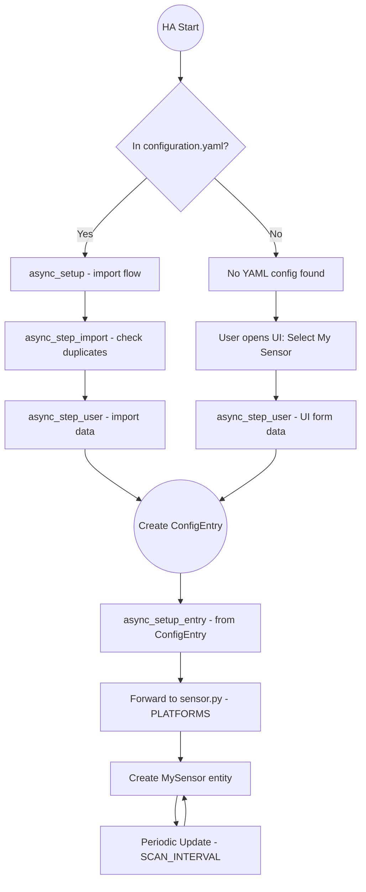

# Homeassistant Example Custom Integration

Copy into `config/custom_components/my_sensor`

Can be configured in `configuration.yaml` or from the UI:

### Example

```yaml
my_sensor:
  - ip_address: localhost
    port: 88888
  - ip_address: localhost
    port: 88889
```

### Flow



#### Funktionsübersicht

- `async_setup(hass: HomeAssistant, config: ConfigType) -> bool`

    ###### When it’s called:

    Triggered during HA startup if the integration key (my_sensor) is found in `configuration.yaml`.

    ###### What it does:
    
    Checks if DOMAIN ("my_sensor") is in the YAML-based config.
    For each device configuration found under my_sensor:, it starts a config flow import (`async_create_task(...) -> async_init(...)`) so that the data is stored in a config entry instead of being processed purely from YAML.

    ###### Why it’s needed:
    
    Ensures that any YAML configuration for this integration is migrated into the UI-based config entries system. Home Assistant is moving toward config entries instead of pure YAML.

- `async_setup_entry(hass: HomeAssistant, entry: ConfigEntry) -> bool`

    ###### When it’s called:
    
    Whenever a new config entry is created or loaded at startup.

    ###### What it does:
    
    Performs “global” setup tasks for the integration (if needed). Forwards the setup to each platform specified in `PLATFORMS`. In this boilerplate, `PLATFORMS = ["sensor"]`, so it calls `async_setup_entry` in `sensor.py`.

    ###### Why it’s needed

    By using the config entries system, each integration can dynamically add or remove platforms/entities. This is also where you’d handle any overarching logic (like setting up library connections, event listeners, etc.).

- `async_step_user in the Config Flow`

    ###### When it’s called:
    
    Manually triggered if a user opens the Integrations page, clicks "Add Integration," and chooses "My Sensor." Also called from async_step_import after verifying new data.

    ###### What it does:
    
    Shows a form (if user_input is None) requiring ip_address and port. If data is submitted, creates a new config entry (self.async_create_entry).

    ###### Why it’s needed:
    
    Provides a user-friendly UI to configure the integration. Also merges the YAML-based approach (import) into the same flow.

- `async_step_import`

    ###### When it’s called:
    
    Triggered by async_init with `context={"source": SOURCE_IMPORT}` from async_setup.

    ###### What it does:
    
    Checks existing entries to avoid duplicating the same ip_address and port. If unique, delegates to async_step_user using the import_data.

    ###### Why it’s needed:
    
    Allows the config flow to handle YAML-based data and treat it just like user-input data, ensuring a single source of truth (the config entry).

- `async_setup_entry in sensor.py`

    ###### When it’s called:
    
    After async_setup_entry in `__init__.py` forwards the sensor platform.

    ###### What it does:
    
    Reads relevant data (ip_address, port) from entry.data. Creates instances of MySensor and registers them with HA using `async_add_entities([MySensor(...)])`.

    ###### Why it’s needed:
    
    This is how we define actual sensor entities in Home Assistant. Each platform (sensor, switch, etc.) has its own async_setup_entry that spins up the appropriate entities.

- `class MySensor`

    ###### Key HA properties:
    
    - `native_value`: The current sensor reading (temperature in this example).
    - `available`: Tells HA whether the sensor is “online.”
    - `SCAN_INTERVAL`: Tells HA how often async_update should be called.
    - `device_info`: Ties the sensor entity to a specific device in the HA device registry.

    - `async_update:`

        Called periodically by HA (and on startup) to fetch new data. In a real integration, you’d talk to your hardware here.
